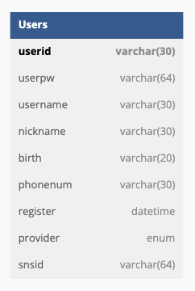

# 백종환 이민수 조

## 설명

-   프로젝트 기간 : 2023년 1월 20일  
-   팀원 : 이민수(팀장), 백종환

### Front Server

> http://127.0.0.1:3005

### Back Server

> http://127.0.0.1:3000

# BASIC

| Method | routes       | 이름               | 설명                              |
| ------ | ------------ | ------------------ | --------------------------------- |
| GET    | /            | 메인페이지         | 메인페이지 이동                   |
| GET    | /about       | About페이지        | About페이지 이동                  |
| GET    | /signin      | 로그인페이지       | 로그인페이지 이동                 |
| GET    | /welcome     | 로그인 성공 페이지 | 로그인에 성공하면 보여지는 페이지 |
| GET    | /signup      | 회원가입페이지     | 회원가입페이지 이동               |
| GET    | /oauth/kakao | 카카오로그인       | 카카오로그인 하기                 |

# AXIOS

> http://127.0.0.1:3000

| Method | routes | 이름         | 설명               |
| ------ | ------ | ------------ | ------------------ |
| GET    | /users | 프로필확인   | 토큰을 같이 보낸다 |
| POST   | /users | 회원가입     | 회원가입           |
| PUT    | /users | 회원정보수정 | 회원 정보 수정     |

| Method | routes           | 이름       | 설명                                          |
| ------ | ---------------- | ---------- | --------------------------------------------- |
| GET    | /check/?userid   | 아이디확인 | 아이디 중복확인                               |
| GET    | /check/?nickname | 닉네임     | 닉네임 중복확인                               |
| POST   | /check/auth      | 로그인     | 로그인시 토큰를 받기위해 백서버로 데이터 보냄 |

# USER TABLE

